# curso-profesional-javascript

# curso-profesiona-javascript
curso-profesiona-javascript

#  conceptos basicos

Entender la estructura jerárquica del DOM,
 donde cada elemento es un nodo.
 
El Document Object Model (DOM) es una representación en forma de árbol de la estructura de un documento HTML. En esta estructura, cada parte del documento, desde la etiqueta html hasta los elementos más pequeños como < p > o < div >, se representa como un nodo en el árbol
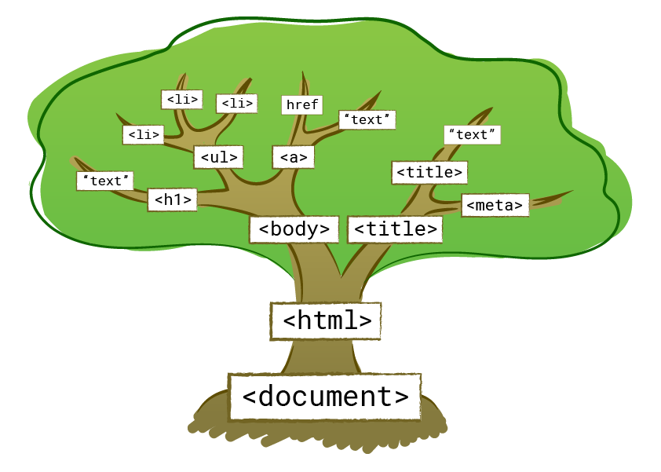

* Hay diferentes tipos de nodos en el DOM:

1. <b> Nodo de Elemento (Element Node):</b>
Representa una etiqueta HTML y todos sus contenidos y atributos. Por ejemplo, < div >, < p >, < a >, etc.

2. <b> Nodo de Texto (Text Node):</b>
Representa <b> el contenido textual dentro de un elemento </b>. Cualquier texto dentro de una etiqueta,  como<strong> < p > "Hola mundo" dentro de un </ p > </strong>, se considera un nodo de texto.

3. <b> Nodo de Atributo(Attribute Node):</b>
Representa un atributo de un elemento. Por ejemplo,el atributo <b>href</b> de un enlace < a>.

4. <b> Nodo de Documento (Document Node): </b>
Este tipo de nodo representa una etiqueta HTML y su contenido. Por ejemplo, < div >, < p>, < a >, etc. Los nodos de elemento pueden tener nodos hijos y pueden tener atributos.

5.<b> Nodo de Comentario (Comment Node):</b>
Representa comentarios dentro del HTML.
< !-- Esto es un comentario -->

La estructura jerárquica del DOM se forma al anidar elementos unos dentro de otros. Cada nodo tiene un padre (excepto el nodo de documento, que es la raíz) y puede tener uno o varios nodos hijos. Los nodos que tienen el mismo padre se denominan hermanos. 

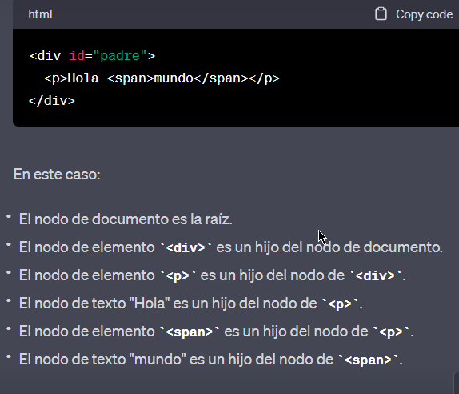

# ejemplo 01-dom

Utilizamos document.getElementById() para obtener referencias a los elementos con los IDs "miParrafo", "miBoton" y "miLista".

Dentro de la función de clic, utilizamos la propiedad textContent para cambiar el texto del párrafo existente.

Finalmente, usamos appendChild() para agregar el nuevo elemento de lista a la lista existente.

# Diferencia entre el DOM y el HTML.

 El DOM crea una estructura en forma de árbol donde cada etiqueta HTML se convierte en un nodo, y los nodos están organizados jerárquicamente según la estructura del documento. Esto permite que los desarrolladores accedan, modifiquen y agreguen contenido y comportamiento a través de lenguajes de programación como JavaScript.

# Acceso y Manipulación:

* document.getElementById('id'): Devuelve el elemento con el ID especificado.

* document.querySelector('.selector'): Devuelve el primer elemento que coincide con el selector CSS.

* document.querySelectorAll('.selector'): Devuelve una lista de todos los elementos que coinciden con el selector CSS.
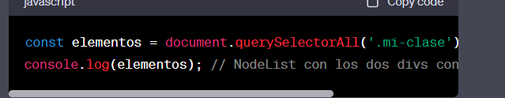
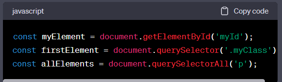

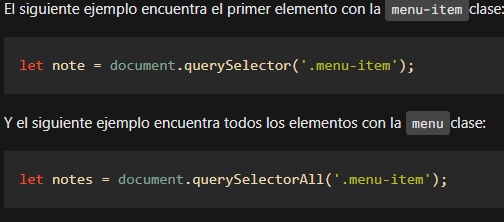
* <b> Manipulación de contenido: </b>

Puedes cambiar el contenido de un elemento utilizando las propiedades <strong> textContent o innerHTML </strong>.

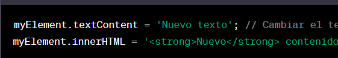

# ejemplo 02-atribute.html
* <b> Modificación de atributos: </b>
Puedes cambiar o acceder a los atributos de un elemento utilizando los métodos <strong> setAttribute() y getAttribute(). </strong>
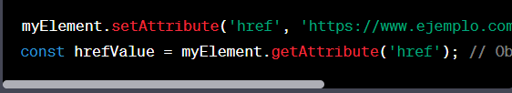

# Manipulación de estilos:

Puedes cambiar los estilos de un elemento utilizando la propiedad style. Sin embargo,<strong> es preferible agregar y eliminar clases CSS para una mejor organización. </strong>
# ejemplo 04-style
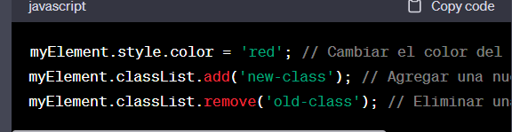.

# Agregando eventos:

Puedes hacer que un elemento responda a eventos, como clics, utilizando addEventListener().
# ejemplo 03-manipucacion-elementos
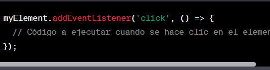

# Eventos

Los eventos son acciones o sucesos que ocurren en el navegador y a los que puedes responder con código JavaScript. Algunos ejemplos de eventos son clics de ratón, pulsaciones de teclas, cambios de tamaño de ventana, envío de formularios, etc.

* Uso de addEventListener():Esta función se ejecutará cada vez que ocurra el evento
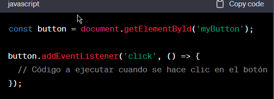

* Entender el objeto event:
Cuando se dispara un evento, se crea automáticamente un objeto event que contiene información relevante sobre ese evento. Puedes acceder a este objeto como parámetro en la función de manejo de eventos.
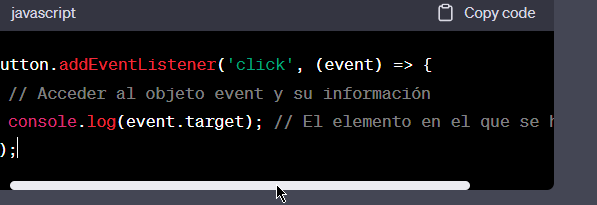

<b> Algunos atributos comunes del objeto event son: </b>

<strong> target: </strong> El elemento en el que ocurrió el evento.  
<strong> type: </strong> El tipo de evento (por ejemplo, 'click', 'keydown').  
<b> clientX, clientY: </b> Las coordenadas X e Y del puntero del ratón en relación con la ventana. 

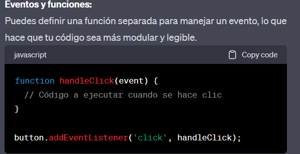

* Detener la propagación de eventos:  
A veces, los eventos pueden propagarse desde el elemento objetivo hasta sus elementos ancestros. Puedes usar event.stopPropagation() para detener esta propagación si es necesario.
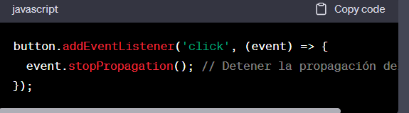

# Creación de Elementos:

* Uso de document.createElement():

El método document.createElement() te permite crear un nuevo elemento HTML. Debes especificar el nombre de la etiqueta del elemento que deseas crear.
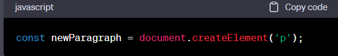

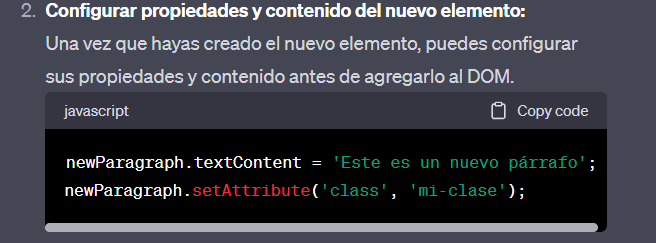

* Agregar el nuevo elemento al DOM:

Para que el nuevo elemento sea visible en la página, debes agregarlo al DOM. Esto se hace utilizando métodos como<b> appendChild() o insertBefore() </b>.

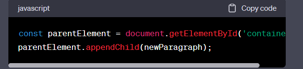

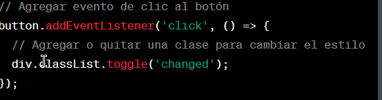

* toggle()

Agregamos un evento de clic al botón usando addEventListener(). Cuando se hace clic, la función toggle() se utiliza en la propiedad classList para agregar o quitar la clase .changed, cambiando así el estilo del div.

nota:
Uso adecuado: El método toggle() es excelente para alternar una clase específica en un elemento, pero no es adecuado si necesitas hacer más acciones complejas junto con el cambio de clase. En tales casos, puede ser mejor utilizar una lógica más detallada

Traversing (Recorrido) del DOM:

Aprende cómo recorrer y navegar a través de los nodos del DOM:
Uso de propiedades como parentNode, childNodes, nextSibling, previousSibling, etc.

# getElementsByTagName
En JavaScript, getElementsByTagName es un método que se utiliza para seleccionar y acceder a todos los elementos de un documento HTML que coinciden con un nombre de etiqueta específico. Es una manera de obtener una colección de elementos basada en su nombre de etiqueta y permite manipular o trabajar con esos elementos de manera programática.

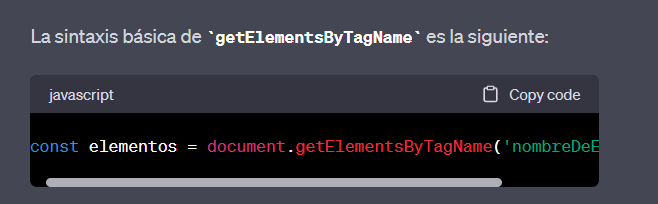

# ejemplo: 05-multiple-select 
Donde 'nombreDeEtiqueta' es el nombre de la etiqueta HTML que estás buscando, como por ejemplo 'p' para los párrafos, 'div' para los elementos div, 'a' para los enlaces, etc.
 
# DOMContentLoaded  

*   es un evento en JavaScript que se dispara cuando el documento HTML ha sido completamente cargado y parseado, lo que significa que el navegador ha construido el modelo de objetos del documento (DOM) a partir del HTML y está listo para interactuar con él a través de JavaScript. Este evento es útil para realizar tareas que deben ejecutarse una vez que la estructura básica del documento esté disponible, pero antes de que se carguen todos los recursos externos, como imágenes, hojas de estilo y scripts.

* Algunos de los usos comunes de DOMContentLoaded incluyen:

Vinculación de eventos: Puedes usar DOMContentLoaded para asegurarte de que los elementos HTML estén disponibles antes de vincular eventos a ellos. Por ejemplo, puedes asignar un manejador de eventos a un botón o un enlace una vez que se haya cargado la página.

ejemplo  05-manupulacion

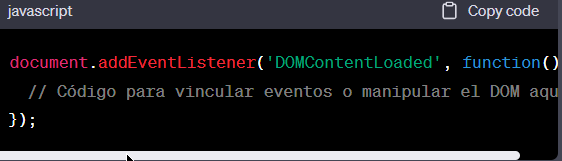

# modulos en javascript 

* Los módulos en JavaScript son una forma de organizar y reutilizar código al dividirlo en archivos separados, cada uno de los cuales puede exportar (hacer disponible) ciertos valores, funciones o clases para ser utilizados en otros archivos (módulos) que los importan. Los módulos permiten una mejor estructuración y modularización del código, lo que facilita el mantenimiento y la colaboración en proyectos grandes y complejos. Los módulos son parte de la especificación ECMAScript (ES6) y se han convertido en una característica fundamental de JavaScript moderno.

1 <strong> Exportación: </strong> En un módulo, puedes exportar variables, funciones, clases o cualquier otro tipo de valor para hacerlo accesible desde otros módulos. Para exportar algo, se utiliza la palabra clave <b> export </b>.
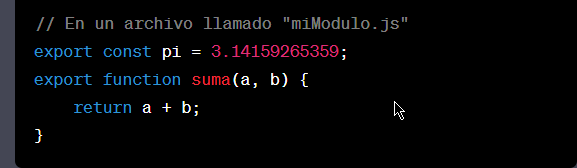

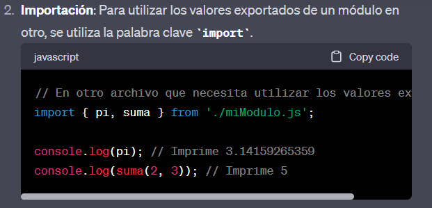

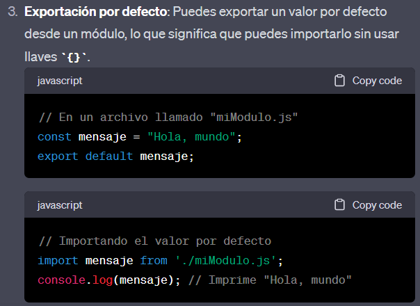

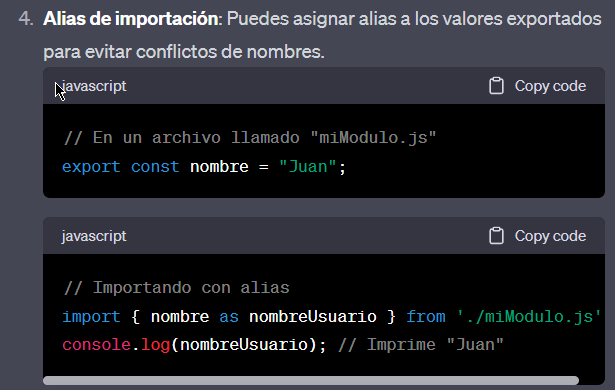

<strong> Módulos circulares: </strong> JavaScript maneja automáticamente los módulos circulares, es decir, cuando dos o más módulos se importan mutuamente.

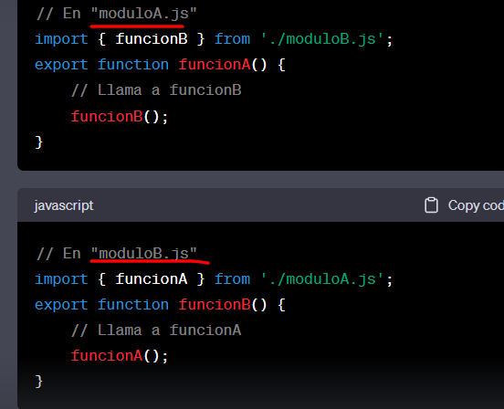

# Dom JavaScript getElementsByName  

!ESTE SELECIONA POR NOMBRE!

name="language"

método de JavaScript para obtener elementos con un nombre determinado en un documento

Cada elemento de un documento HTML puede tener un nameatributo:

< input type="radio" name="language" value="JavaScript" >

A diferencia del idatributo, varios elementos HTML pueden compartir el mismo valueatributo namede esta manera:

< input type="radio" name="language" value="JavaScript">

< input type="radio" name="language" value="TypeScript" >

Para obtener todos los elementos con un nombre específico, utiliza el getElementsByName()método 

* ejemplo 06-obtenerName
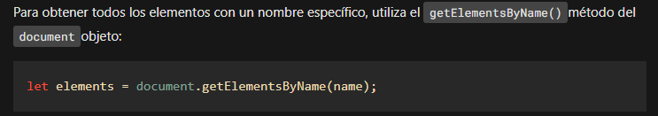

# getElementsByTagName()   : selecciona elementos por un nombre de etiqueta.

El getElementsByTagName()método acepta un nombre de etiqueta y devuelve una lista HTMLCollectionde elementos con el nombre de etiqueta coincidente en el orden en que aparecen en el documento.
*  Ejeplo 07-select-etiqueta

# getElementsByClassName() : selecciona elementos por uno o más nombres de clase.

Al llamar al método en el documentelemento, busca en todo el documento y devuelve los elementos secundarios del documento:

ejemplo : 08-select-padres

# Sección 3. Objeto de evento

Un evento es una acción que ocurre en el navegador web, que el navegador web le envía información para que pueda responder.

Cuando ocurre el <b> evento </b>, el navegador web pasa un Eventobjeto al controlador de eventos:

# prevenirDefault()
Para evitar el comportamiento predeterminado de un evento, utiliza el preventDefault()método.
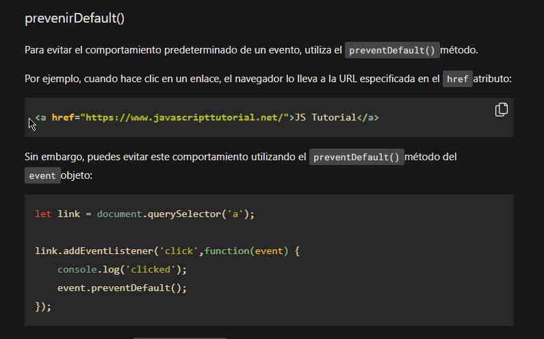

* Úselo addEventListener()para registrar un evento que conecta un evento a un detector de eventos.

* event Solo se puede acceder al objeto dentro del detector de eventos.
*  Utilice preventDefault()el método para evitar el comportamiento predeterminado de un evento, pero no detiene el flujo del evento.

* Utilice stopPropagation()el método para detener el flujo de un evento a través del árbol DOM, pero no cancela el comportamiento predeterminado del navegador.

# 1) atributos del controlador de eventos HTML

Los controladores de eventos normalmente tienen nombres que comienzan con <b> on</b>, por ejemplo, el controlador de eventos del click evento es onclick.

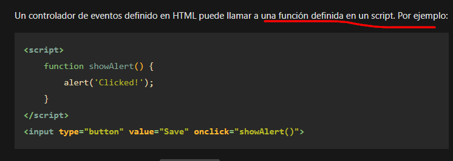

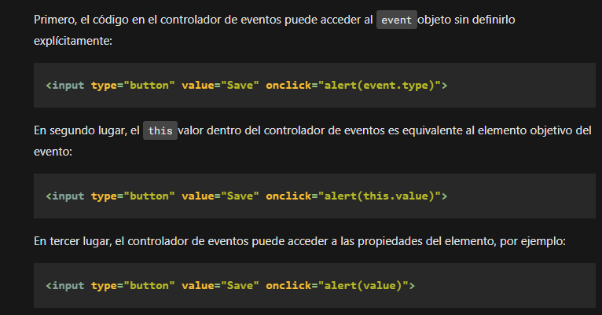

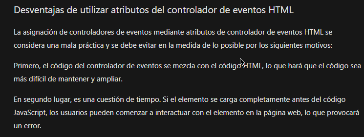

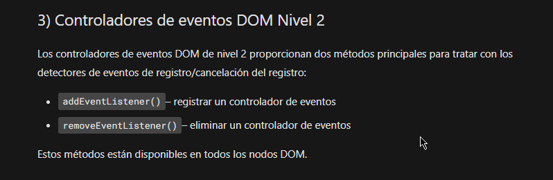

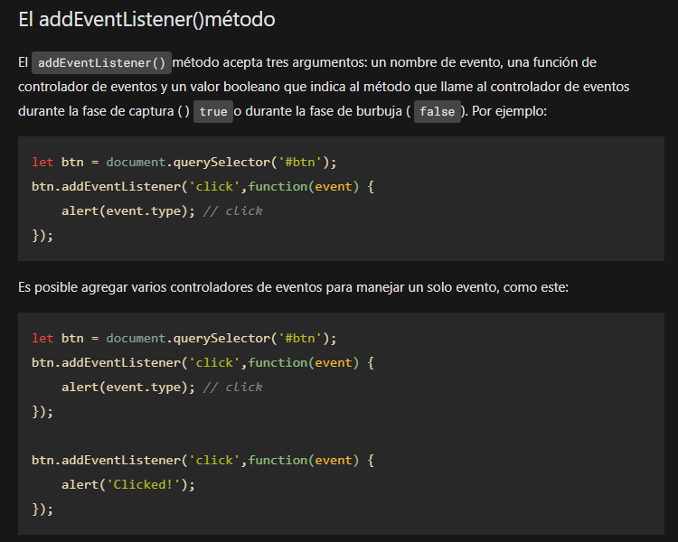

# Eventos de carga de página de JavaScript
---1 
* DOMContentLoaded– el navegador cargó completamente el HTML y completó la construcción del árbol DOM. Sin embargo, no ha cargado recursos externos como hojas de estilo e imágenes. En este caso, puede comenzar a seleccionar nodos DOM o inicializar la interfaz.

* load– el navegador cargó completamente el HTML y también recursos externos como imágenes y hojas de estilo.

Cuando sales de la página, los siguientes eventos se activan en secuencia:

* beforeunload– se activa antes de que se descarguen la página y los recursos. Puede utilizar este evento para mostrar un cuadro de diálogo de confirmación para confirmar si realmente desea abandonar la página. Al hacer esto, puede evitar la pérdida de datos en caso de que esté completando un formulario y accidentalmente haga clic en un enlace para navegar a otra página.

* unload– se activa cuando la página se ha descargado por completo. Puede utilizar este evento para enviar los datos analíticos o para limpiar recursos.
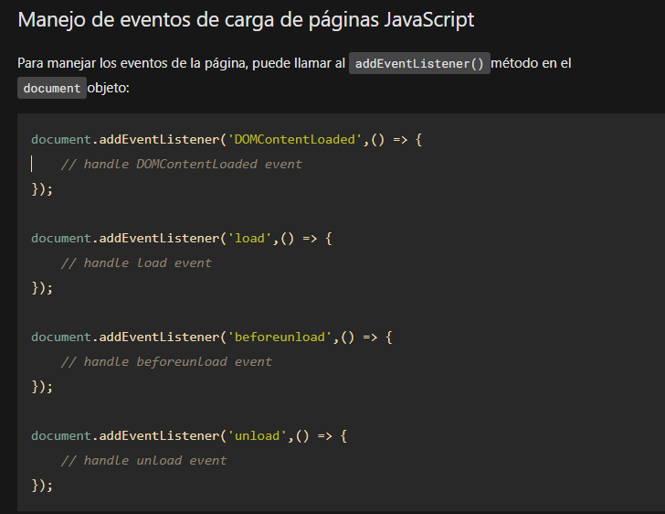

ejemplo 10-eventos archivo index02.html

--- 2 

# DOMContentLoaded:

Debes manejar el DOMContentLoadedevento cuando colocas el JavaScript en la headpágina pero haciendo referencia a elementos en el cuerpo.

* Este evento se dispara cuando el DOM (Document Object Model) ha sido completamente cargado y parseado, pero antes de que se carguen otros recursos como imágenes, hojas de estilo externas o scripts externos.

* Es útil cuando quieres interactuar con los elementos HTML de tu página o manipular el DOM antes de que todos los recursos, como imágenes, estén completamente cargados.

* Puedes usar este evento cuando necesitas acceder y manipular elementos del DOM de inmediato, sin tener que esperar a que se carguen las imágenes u otros recursos.
Ejemplo de uso de DOMContentLoaded:

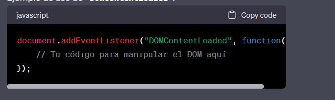

# load
* El evento load se dispara cuando se ha cargado completamente toda la página web, incluyendo imágenes y otros recursos externos.

* Es útil cuando necesitas realizar acciones que dependen de que todos los recursos de la página se hayan cargado, como obtener las dimensiones de una imagen o realizar cálculos basados en el contenido completo de la página.

* Ten en cuenta que el evento load se dispara después de DOMContentLoaded, por lo que si solo necesitas manipular el DOM, es posible <b> que DOMContentLoaded sea más apropiado </b>.

# eventos del mouse de JavaScript

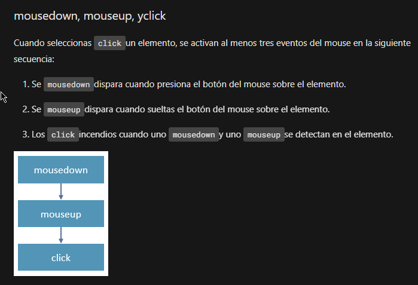

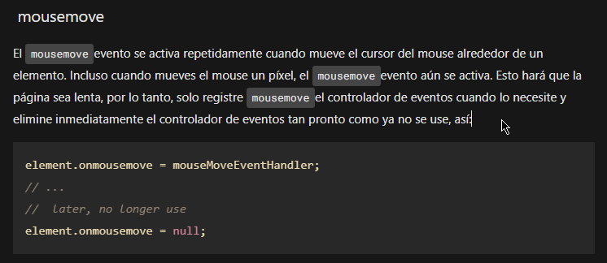

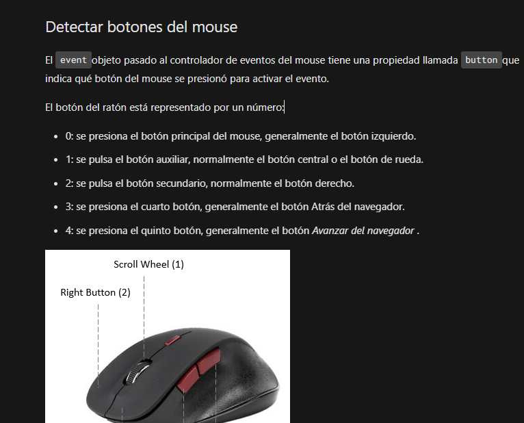

* ejemplo  11-eveto-mouse

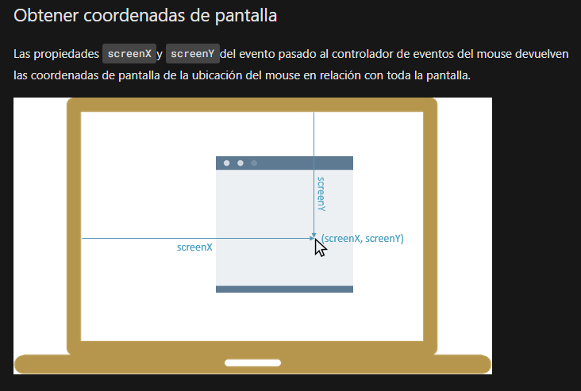

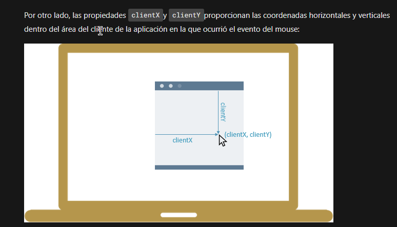

# Eventos mas comunes del DOM

se describen algunos de los eventos más comunes en el DOM:

click: Este evento se activa cuando un elemento se hace clic con el ratón.

mouseenter / mouseleave: Estos eventos se activan cuando el puntero del ratón entra o sale de un elemento, respectivamente.

mousedown / mouseup: Se activan cuando se presiona o se suelta el botón del ratón en un elemento.

keydown / keyup: Estos eventos se disparan cuando se presiona o se suelta una tecla en el teclado.

submit: Se activa cuando se envía un formulario.

load: Se dispara cuando un recurso, como una imagen o un archivo de audio, se ha cargado completamente.

DOMContentLoaded: Se activa cuando el documento HTML se ha cargado completamente, incluso si los recursos externos, como imágenes, aún no se han cargado.

resize: Este evento se dispara cuando se cambia el tamaño de la ventana del navegador.

scroll: Se activa cuando el usuario desplaza la página web hacia arriba o hacia abajo.

focus / blur: Estos eventos se activan cuando un elemento obtiene o pierde el foco, por ejemplo, cuando se hace clic en un campo de entrada o se sale de él.

change: Se activa cuando el valor de un campo de entrada, como un cuadro de texto o un menú desplegable, cambia.

contextmenu: Se dispara cuando se hace clic con el botón derecho del ratón en un elemento, mostrando un menú contextual.

drag / dragstart / dragend / dragenter / dragleave / dragover / drop: Estos eventos están relacionados con la funcionalidad de arrastrar y soltar elementos en la página.

touchstart / touchmove / touchend: Eventos táctiles que se disparan en dispositivos con pantalla táctil.

error: Se activa cuando se produce un error en la carga de un recurso, como una imagen que no se puede cargar.

animationstart / animationiteration / animationend: Estos eventos se activan durante la animación de elementos HTML cuando comienzan, repiten o terminan.

 

      

* Manipulación Avanzada:

Profundiza en técnicas más avanzadas:

Uso de bibliotecas como jQuery para simplificar la manipulación del DOM.

Entender la propagación y la detección de eventos.
Manipulación de estilos con CSS classes en lugar de element.style.
Eliminación de elementos del DOM con remove().

* Práctica y Proyectos:
La práctica es esencial. Crea pequeños proyectos web donde puedas aplicar lo que has aprendido sobre el DOM.
